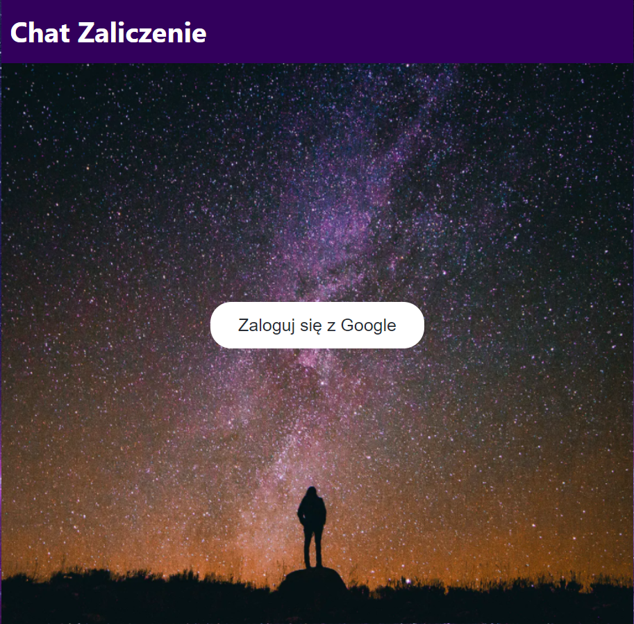
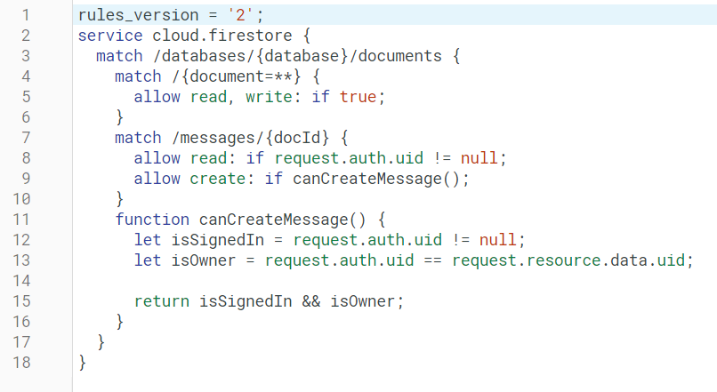
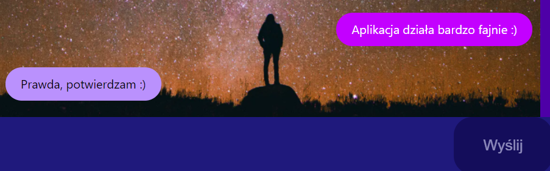
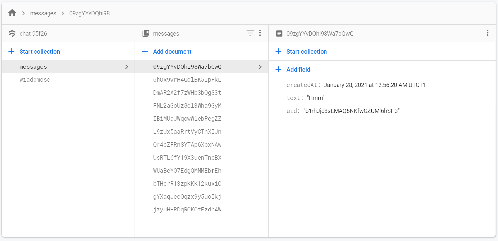

# React Chat
Jest to prosta aplikacja napisana przy użyciu React'a oraz bazy danych Firebase. Pozwala ona na komunikowanie się z każdą zalogowaną osobą przy pomocy wspólnego chatu.

## Co umożliwia mi ta aplikacja?
Przy jej pomocy możesz komunikować się z każdą osobą posiadająca link do strony internetowej. Jest to przydatne rozwiązanie dla grup osób, które chcą pozostać w stałym kontakcie. Dzięki potrzeby logowania przy pomocy konta Google oraz autentykacji jest to bezpieczne rozwiązanie.

## Jak używać
Po sklonowaniu repozytorium, w terminalu wejdź do katalogu głównego i wpisz `npm start` aby włączyć aplikację. Będziesz mógł się do niej dostać na localhost:3000.

Następnie należy się zalogować przy pomocy konta Google.
Po wykonaniu tego kroku naszym oczom powinien ukazać się chat w pełni zsynchronizowany z bazą danych Firebase, pozwalającą na rozmowy grupowe w czasie rzeczywistym.

## Wykorzystane technologie
- React
- CSS
- JavaScript
- Firebase

## Autorzy
Praca została wykonana samodzielnie przez Michała Dziadczykowskiego, studenta z grupy S32-32 z wydziału zarządzania w Gdańsku jako projekt zaliczeniowy.
